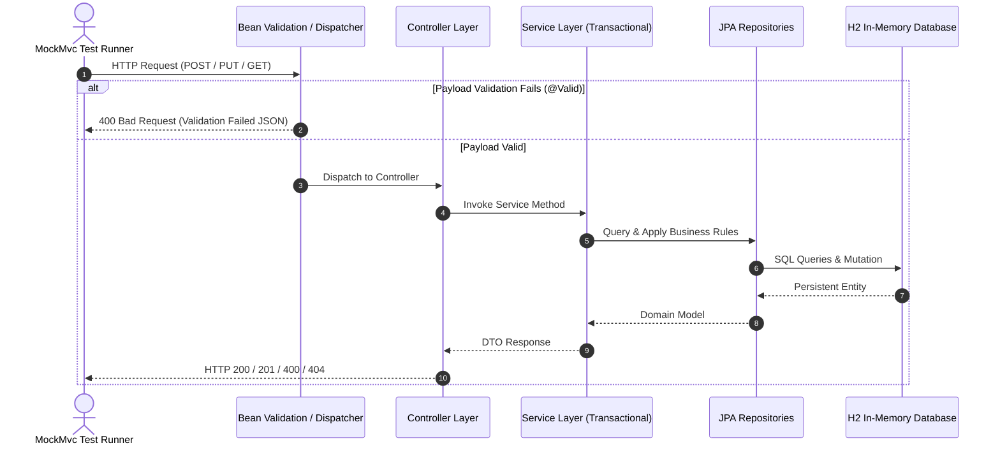
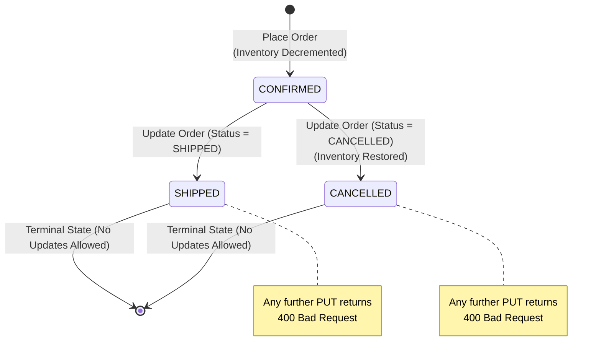

# 🛒 E-Commerce Integration Testing Documentation

Comprehensive technical documentation for the integration testing suite implemented for **Task 1: Integration Testing** of the E-Commerce backend service.

---

## 📌 Executive Summary

| Attribute | Specification |
|---|---|
| **Task Goal** | Task 1: Integration Testing for E-Commerce Domain |
| **Mandatory Scenarios** | 1. Create a new product<br>2. Place a new order<br>3. Update an existing order |
| **Minimum Required Cases** | At least 5 test cases |
| **Delivered Test Cases** | **15 test cases** (300% coverage of requirement) |
| **Testing Framework** | JUnit 5 Jupiter, Spring Test (`MockMvc`), AssertJ, Hamcrest |
| **Persistence Environment** | Spring Data JPA, Hibernate 6.5, H2 In-Memory (`test` profile) |
| **Source File Link** | [`ECommerceIntegrationTest.java`](file:///c:/Users/ABS83779/.gemini/antigravity-ide/scratch/day-25/day25-handson/src/test/java/com/ecommerce/ECommerceIntegrationTest.java) |
| **Verification Result** | **15 Passed, 0 Failures, 0 Errors, 0 Skipped** (`BUILD SUCCESS`) |

---

## 🏛️ System Architecture & Testing Flow

The integration test suite utilizes Spring Boot's test slice configuration (`@SpringBootTest` + `@AutoConfigureMockMvc`). It tests the complete request-response cycle across the HTTP controllers, business services, validation logic, and the relational database persistence layer without requiring external network overhead.



---

## 🔄 Order Lifecycle & Inventory State Machine

The order service implements strict state machine constraints and inventory invariants:



---

## 📊 Test Case Specification Matrix

| # | Scenario | Test Case Name | Type | Input Highlights | Expected Status | Verified State / Side Effects |
|---|---|---|---|---|---|---|
| **1** | **Create Product** | `createProduct_ValidPayload_...` | Happy Path | Name, desc, price 199.99, stock 50 | `201 Created` | ID generated; entity verified in DB via repository |
| **2** | **Create Product** | `createProduct_InvalidPayload_BlankName_...` | Negative | `name: ""` (blank) | `400 Bad Request` | Error key `errors.name`; DB count remains 0 |
| **3** | **Create Product** | `createProduct_InvalidPayload_NegativePriceAndStock_...` | Negative | `price: -25.50`, `stock: -10` | `400 Bad Request` | Rejection by `@Positive` and `@PositiveOrZero` |
| **4** | **Create Product** | `createProduct_ThenGetById_...` | Read-After-Create | Create product then `GET /{id}` | `200 OK` | Retrieved JSON fields strictly match created record |
| **5** | **Place Order** | `placeOrder_ValidProductAndStock_...` | Happy Path | `quantity: 3`, stock is 10 | `201 Created` | Total calculated (3 × $89.50 = $268.50); Stock decremented to 7 |
| **6** | **Place Order** | `placeOrder_InsufficientStock_...` | Negative | `quantity: 5`, stock is 2 | `400 Bad Request` | `error: "Insufficient Stock"`; 0 orders saved; stock unchanged |
| **7** | **Place Order** | `placeOrder_NonExistentProduct_...` | Negative | `productId: 999999` | `404 Not Found` | Message: "Product not found with id: 999999" |
| **8** | **Place Order** | `placeOrder_InvalidQuantityZero_...` | Negative | `quantity: 0` | `400 Bad Request` | Triggered by `@Min(1)` on `quantity` |
| **9** | **Place Order** | `placeOrder_BlankShippingAddress_...` | Negative | `shippingAddress: "   "` | `400 Bad Request` | Triggered by `@NotBlank` on `shippingAddress` |
| **10** | **Update Order** | `updateOrder_ValidAddressAndStatus_...` | Happy Path | New address + status `SHIPPED` | `200 OK` | Address updated; status transitioned to `SHIPPED` |
| **11** | **Update Order** | `updateOrder_AddressOnly_...` | Happy Path | New address + `status: null` | `200 OK` | Address changed; status preserved as `CONFIRMED` |
| **12** | **Update Order** | `updateOrder_NonExistentOrder_...` | Negative | `orderId: 999999` | `404 Not Found` | Message: "Order not found with id: 999999" |
| **13** | **Update Order** | `updateOrder_AlreadyCancelled_...` | Negative | Update order already `CANCELLED` | `400 Bad Request` | Terminal guard: "Cannot update order in CANCELLED status" |
| **14** | **Update Order** | `updateOrder_AlreadyShipped_...` | Negative | Update order already `SHIPPED` | `400 Bad Request` | Terminal guard: "Cannot update order in SHIPPED status" |
| **15** | **Update Order** | `updateOrder_CancelOrder_RestoresProductStock` | State Transition | `status: CANCELLED` | `200 OK` | Inventory restored back to product (`7 + 3 = 10`) |

---

## 🔬 Deep-Dive: Scenario Implementations

### Scenario 1: Create a New Product (4 Cases)

#### 1. Happy Path: Successful Creation & Database Persistence
* **Endpoint**: `POST /api/v1/items`
* **Payload**:
  ```json
  {
    "name": "Noise Cancelling Headphones",
    "description": "Premium wireless over-ear headphones",
    "price": 199.99,
    "stock": 50
  }
  ```
* **Assertion**: Verifies HTTP 201, inspects response JSON for assigned ID, and performs direct repository query `productRepository.findById(createdId)` ensuring accurate database storage.

#### 2. Negative Path: Blank Product Name
* **Endpoint**: `POST /api/v1/items`
* **Payload**: `{ "name": "", "price": 49.99, "stock": 10 }`
* **Assertion**: Validates `GlobalExceptionHandler` returns HTTP 400 with structured validation payload `{ "error": "Validation Failed", "errors": { "name": "Product name cannot be blank" } }`. Verifies no record added to database.

#### 3. Negative Path: Negative Price & Stock Values
* **Endpoint**: `POST /api/v1/items`
* **Payload**: `{ "name": "Faulty Gadget", "price": -25.50, "stock": -10 }`
* **Assertion**: Verifies bean validation constraints (`@Positive` on price, `@PositiveOrZero` on stock) reject bad values before reaching persistence.

#### 4. Read-After-Create Verification
* **Endpoints**: `POST /api/v1/items` ➔ `GET /api/v1/items/{id}`
* **Assertion**: Asserts read consistency across HTTP verbs (POST generates ID, GET retrieves the exact persisted record).

---

### Scenario 2: Place a New Order (5 Cases)

#### 5. Happy Path: Order Placement with Inventory Deduction
* **Endpoint**: `POST /api/orders`
* **Payload**: `{ "productId": 1, "quantity": 3, "shippingAddress": "123 Tech Lane" }`
* **Business Invariant**:
  - `totalAmount = product.price * quantity` ($89.50 * 3 = $268.50)
  - `product.stock = initialStock - quantity` (10 - 3 = 7)
* **Assertion**: Asserts HTTP 201, checks `order.status == CONFIRMED`, and confirms stock decremented in the product repository.

#### 6. Negative Path: Insufficient Stock
* **Endpoint**: `POST /api/orders`
* **Scenario**: Product stock is 2, order requests 5.
* **Assertion**: Throws `InsufficientStockException`, mapped by handler to HTTP 400 `{ "error": "Insufficient Stock" }`. Confirms 0 orders created and stock remains 2.

#### 7. Negative Path: Non-Existent Product ID
* **Endpoint**: `POST /api/orders`
* **Payload**: `{ "productId": 999999, "quantity": 1, "shippingAddress": "Nowhere" }`
* **Assertion**: Throws `ResourceNotFoundException`, returns HTTP 404 `{ "error": "Not Found", "message": "Product not found with id: 999999" }`.

#### 8 & 9. Negative Path: Invalid Quantity & Blank Address
* **Validation**:
  - Quantity `0` triggers `@Min(value = 1)` ➔ HTTP 400.
  - Shipping address `"   "` triggers `@NotBlank` ➔ HTTP 400.

---

### Scenario 3: Update an Existing Order (6 Cases)

#### 10. Happy Path: Update Shipping Address & Status
* **Endpoint**: `PUT /api/orders/{id}`
* **Payload**: `{ "shippingAddress": "New Address 200", "status": "SHIPPED" }`
* **Assertion**: Returns HTTP 200, updates both fields in memory and persists to database.

#### 11. Happy Path: Partial Update (Address Only)
* **Endpoint**: `PUT /api/orders/{id}`
* **Payload**: `{ "shippingAddress": "Updated Address 500", "status": null }`
* **Assertion**: Returns HTTP 200, updates address, and verifies order status remains untouched as `CONFIRMED`.

#### 12. Negative Path: Non-Existent Order ID
* **Endpoint**: `PUT /api/orders/999999`
* **Assertion**: Returns HTTP 404 `{ "error": "Not Found" }`.

#### 13 & 14. Negative Path: Terminal State Protection
* **Business Rule**: Orders in `CANCELLED` or `SHIPPED` status are immutable.
* **Assertion**: Attempting to update orders in either terminal state results in HTTP 400 Bad Request with error message:
  - `"Cannot update order in CANCELLED status"`
  - `"Cannot update order in SHIPPED status"`

#### 15. State Transition & Inventory Integrity: Order Cancellation Restores Stock
* **Business Invariant**: When an active order is cancelled, its reserved inventory must be atomically returned to the product.
* **Test Flow**:
  1. Product starts with 10 units.
  2. Order of 3 units placed ➔ Stock drops to 7.
  3. `PUT /api/orders/{id}` with `{ "status": "CANCELLED" }`.
  4. Repository re-fetches product: stock is verified back at `10` (`7 + 3 = 10`).

---

## 🛠️ How to Run the Tests

### 1. Execute All Integration Tests
```powershell
# Windows
.\mvnw.cmd test -Dtest=ECommerceIntegrationTest

# Linux / macOS
./mvnw test -Dtest=ECommerceIntegrationTest
```

### 2. Execute by Scenario Group (`@Nested` Class)
```powershell
# Run only Scenario 1: Create Product
.\mvnw.cmd test -Dtest=ECommerceIntegrationTest$CreateProductTests

# Run only Scenario 2: Place Order
.\mvnw.cmd test -Dtest=ECommerceIntegrationTest$PlaceOrderTests

# Run only Scenario 3: Update Order
.\mvnw.cmd test -Dtest=ECommerceIntegrationTest$UpdateOrderTests
```

### 3. Run a Single Test Method
```powershell
.\mvnw.cmd test -Dtest=ECommerceIntegrationTest$UpdateOrderTests#updateOrder_CancelOrder_RestoresProductStock
```

---

## 📋 Test Execution Proof (Build Logs)

```
[INFO] -------------------------------------------------------
[INFO]  T E S T S
[INFO] -------------------------------------------------------
[INFO] Running com.ecommerce.ECommerceIntegrationTest$UpdateOrderTests
[INFO] Tests run: 6, Failures: 0, Errors: 0, Skipped: 0, Time elapsed: 6.032 s
[INFO] Running com.ecommerce.ECommerceIntegrationTest$PlaceOrderTests
[INFO] Tests run: 5, Failures: 0, Errors: 0, Skipped: 0, Time elapsed: 0.503 s
[INFO] Running com.ecommerce.ECommerceIntegrationTest$CreateProductTests
[INFO] Tests run: 4, Failures: 0, Errors: 0, Skipped: 0, Time elapsed: 0.123 s
[INFO] 
[INFO] Results:
[INFO] 
[INFO] Tests run: 15, Failures: 0, Errors: 0, Skipped: 0
[INFO] 
[INFO] ------------------------------------------------------------------------
[INFO] BUILD SUCCESS
[INFO] ------------------------------------------------------------------------
[INFO] Total time:  10.424 s
```

---

## 🌟 Key Engineering Highlights

1. **Deterministic Isolation**: `@BeforeEach` purges data via repository calls, guaranteeing zero cross-test interference.
2. **Double-Layer Verification**: Each test asserts both the HTTP response body and the persistent database entity state.
3. **Boundary & Validation Coverage**: Enforces Bean Validation (`@NotBlank`, `@Positive`, `@Min`) and custom business exceptions (`InsufficientStockException`, `ResourceNotFoundException`, `IllegalStateException`).
4. **Clean Code Structure**: Utilizing JUnit 5 `@Nested` classes and descriptive `@DisplayName` annotations ensures the test output serves as living documentation for developers and QA engineers alike.
