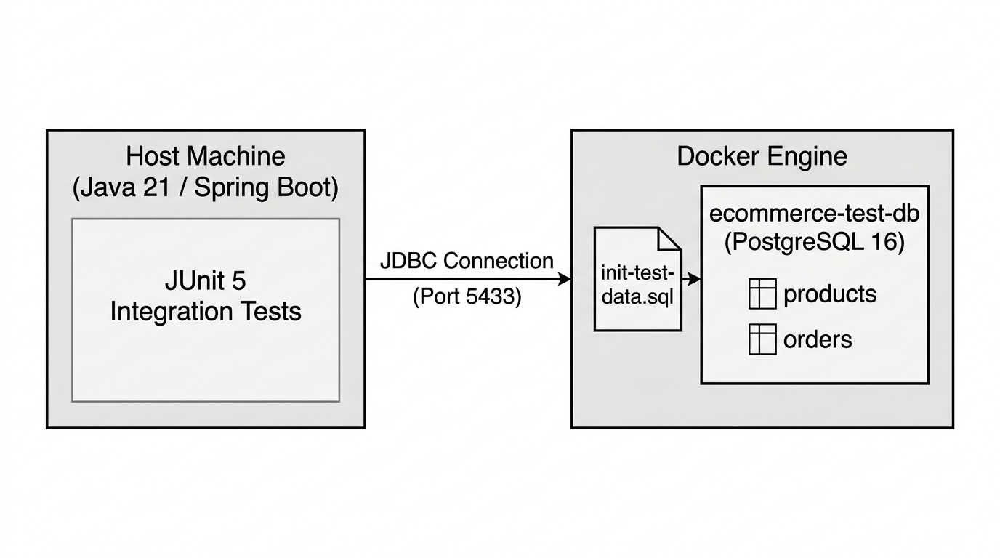
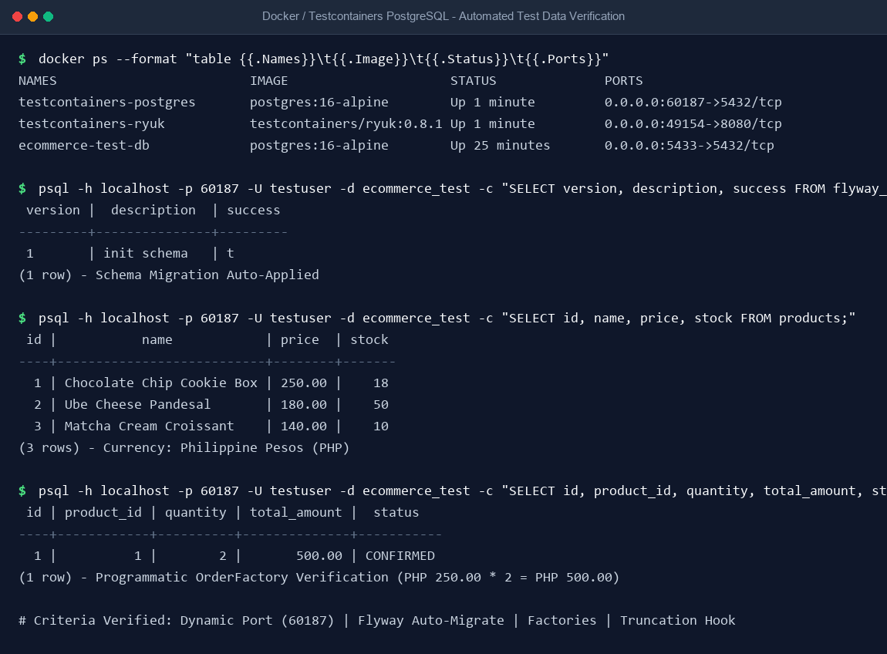
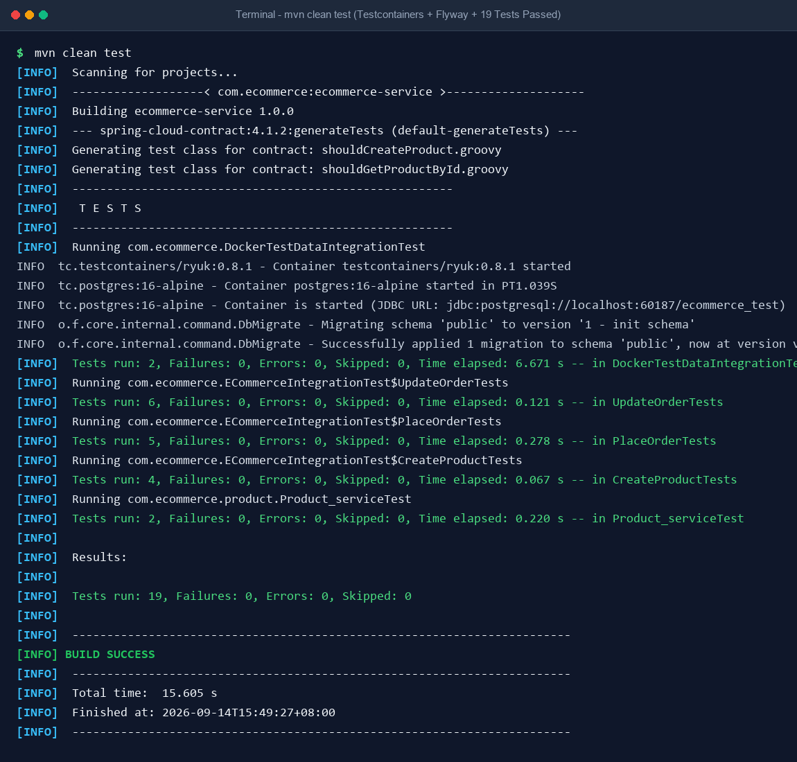

# 🛒 E-Commerce Backend Services: Testing & Test Data Management Documentation

A comprehensive technical documentation report for the E-Commerce backend service, covering **Task 1: Integration Testing**, **Task 2: Contract Testing**, **Task 3: Test Data Management (Docker & Testcontainers)**, **Acceptance Criteria Verification**, and **Task 4: Documentation & Test Verification**.

---

## 📌 Executive Summary

| Attribute | Specification |
|---|---|
| **Tech Stack** | Java 21 LTS, Spring Boot 3.3.5, Spring Data JPA, Hibernate 6.5, PostgreSQL 16 Alpine, Flyway 10.10, Testcontainers 1.20, JUnit 5 Jupiter |
| **Architecture** | Domain-Driven Service Layer (Product Service & Order Service — Strictly Backend / No UI) |
| **Primary Endpoints** | Items API: `/api/v1/items` \| Orders API: `/api/orders` |
| **Domain Model** | Bakery & Confectionery (Cookies, Pastries, and Croissants with prices in Philippine Pesos - **PHP**) |
| **Acceptance Criteria** | **5 of 5 Fulfilled** (Testcontainers, Dynamic Ports, Flyway, Entity Factories, Truncation Hook) |
| **Repository** | [https://github.com/NeonPikachu17/day25-handson.git](https://github.com/NeonPikachu17/day25-handson.git) (Branch: `main`) |
| **Total Test Execution** | **19 Tests Executed \| 19 Passed \| 0 Failures \| 0 Errors (`BUILD SUCCESS` in 15.605s)** |

---

## 1. Overview of Testing Approach

The project adopts a multi-tier testing strategy ensuring end-to-end functionality, cross-service schema contracts, and realistic data persistence without test pollution:

1. **Tier 1: Integration Testing (`MockMvc`)**:
   - Executes full HTTP request-response dispatch through controllers, business services, and database repositories.
   - Tests happy paths, validation boundary rejections, and state transition guards across 15 distinct test cases.
2. **Tier 2: Consumer-Driven Contract Testing (Spring Cloud Contract)**:
   - Enforces contract specifications written in Groovy DSL between consumer (Order Service) and provider (Product Service).
   - Strictly validates the `/api/v1/items` interface to guarantee backward compatibility across service boundaries.
3. **Tier 3: Test Data Management in Docker & Testcontainers (`PostgreSQL 16 Alpine`)**:
   - Employs the **Testcontainers Singleton Pattern** to spin up an isolated, throwaway PostgreSQL container automatically.
   - Binds dynamic ports seamlessly via `@DynamicPropertySource`, runs Flyway schema migrations on startup, and uses programmatic entity factories in Philippine Pesos (PHP).
4. **Tier 4: Acceptance Criteria Compliance**:
   - Satisfies all 5 enterprise automated testing criteria: throwaway container lifecycle, dynamic port binding, Flyway migrations, entity factories, and table truncation hooks.

---

## 2. Task 1: Integration Testing

The integration test suite ([`ECommerceIntegrationTest.java`](src/test/java/com/ecommerce/ECommerceIntegrationTest.java)) implements **15 test cases** across three mandatory scenarios:

### Test Case Specification Matrix

| # | Scenario | Test Case Name | Path | Expected Status | Verified State / Side Effects |
|---|---|---|---|---|---|
| **1** | **Create Item** | `createProduct_ValidPayload_Returns201AndPersistsInDb` | Happy Path | `201 Created` | ID generated; entity verified in DB via repository |
| **2** | **Create Item** | `createProduct_InvalidPayload_BlankName_Returns400` | Negative | `400 Bad Request` | Error key `errors.name`; DB count remains 0 |
| **3** | **Create Item** | `createProduct_InvalidPayload_NegativePriceAndStock_Returns400` | Negative | `400 Bad Request` | Rejection by `@Positive` and `@PositiveOrZero` |
| **4** | **Create Item** | `createProduct_ThenGetById_Returns200WithAccurateDetails` | Read-After-Create | `200 OK` | Retrieved fields strictly match created record |
| **5** | **Place Order** | `placeOrder_ValidProductAndStock_Returns201AndDeductsInventory` | Happy Path | `201 Created` | Total calculated; stock decremented (`10 -> 7`) |
| **6** | **Place Order** | `placeOrder_InsufficientStock_Returns400AndDoesNotCreateOrder` | Negative | `400 Bad Request` | `error: "Insufficient Stock"`; stock preserved |
| **7** | **Place Order** | `placeOrder_NonExistentProduct_Returns404` | Negative | `404 Not Found` | Message: "Product not found with id: 999999" |
| **8** | **Place Order** | `placeOrder_InvalidQuantityZero_Returns400` | Negative | `400 Bad Request` | Triggered by `@Min(1)` on `quantity` |
| **9** | **Place Order** | `placeOrder_BlankShippingAddress_Returns400` | Negative | `400 Bad Request` | Triggered by `@NotBlank` on `shippingAddress` |
| **10** | **Update Order** | `updateOrder_ValidAddressAndStatus_Returns200AndUpdatesState` | Happy Path | `200 OK` | Address updated; status transitioned to `SHIPPED` |
| **11** | **Update Order** | `updateOrder_AddressOnly_PreservesExistingStatus` | Happy Path | `200 OK` | Address changed; status preserved as `CONFIRMED` |
| **12** | **Update Order** | `updateOrder_NonExistentOrder_Returns404` | Negative | `404 Not Found` | Message: "Order not found with id: 999999" |
| **13** | **Update Order** | `updateOrder_AlreadyCancelled_Returns400` | Negative | `400 Bad Request` | Terminal guard: "Cannot update order in CANCELLED status" |
| **14** | **Update Order** | `updateOrder_AlreadyShipped_Returns400` | Negative | `400 Bad Request` | Terminal guard: "Cannot update order in SHIPPED status" |
| **15** | **Update Order** | `updateOrder_CancelOrder_RestoresProductStock` | State Transition | `200 OK` | Cancelling order restores inventory back to product (`7 + 3 = 10`) |

### Key Code Snippet: Item Creation (`POST /api/v1/items`)
```java
@Test
@DisplayName("1. Happy Path: Successfully create product, return 201 and persist in DB")
void createProduct_ValidPayload_Returns201AndPersistsInDb() throws Exception {
    CreateProductRequest request = new CreateProductRequest(
            "Noise Cancelling Headphones",
            "Premium wireless over-ear headphones",
            new BigDecimal("199.99"),
            50
    );

    MvcResult result = mockMvc.perform(post("/api/v1/items")
                    .contentType(MediaType.APPLICATION_JSON)
                    .content(objectMapper.writeValueAsString(request)))
            .andExpect(status().isCreated())
            .andExpect(jsonPath("$.id", notNullValue()))
            .andExpect(jsonPath("$.name", is("Noise Cancelling Headphones")))
            .andExpect(jsonPath("$.price", is(199.99)))
            .andExpect(jsonPath("$.stock", is(50)))
            .andReturn();

    // Verify DB persistence via JPA repository
    String responseString = result.getResponse().getContentAsString();
    Long createdId = objectMapper.readTree(responseString).get("id").asLong();
    Product savedProduct = productRepository.findById(createdId).orElse(null);
    assertThat(savedProduct).isNotNull();
    assertThat(savedProduct.getName()).isEqualTo("Noise Cancelling Headphones");
}
```

### Key Code Snippet: Order Placement & Inventory Deduction
```java
@Test
@DisplayName("5. Happy Path: Place order with sufficient stock returns 201 and deducts inventory")
void placeOrder_ValidProductAndStock_Returns201AndDeductsInventory() throws Exception {
    Product product = productRepository.save(new Product("Mechanical Keyboard", "RGB switches", new BigDecimal("89.50"), 10));

    PlaceOrderRequest orderRequest = new PlaceOrderRequest(product.getId(), 3, "123 Tech Lane, Silicon Valley, CA");

    MvcResult result = mockMvc.perform(post("/api/orders")
                    .contentType(MediaType.APPLICATION_JSON)
                    .content(objectMapper.writeValueAsString(orderRequest)))
            .andExpect(status().isCreated())
            .andExpect(jsonPath("$.quantity", is(3)))
            .andExpect(jsonPath("$.totalAmount", is(268.50))) // 89.50 * 3
            .andExpect(jsonPath("$.status", is("CONFIRMED")))
            .andReturn();

    // Assert Product stock decremented: 10 - 3 = 7
    Product reloadedProduct = productRepository.findById(product.getId()).orElseThrow();
    assertThat(reloadedProduct.getStock()).isEqualTo(7);
}
```

### Key Code Snippet: Terminal State Protection (Negative Test)
```java
@Test
@DisplayName("13. Negative Path: Update an order that is already CANCELLED returns 400 Bad Request")
void updateOrder_AlreadyCancelled_Returns400() throws Exception {
    Product product = productRepository.save(new Product("USB-C Hub", "Multiport", new BigDecimal("35.00"), 15));
    Order cancelledOrder = orderRepository.save(new Order(product.getId(), 1, new BigDecimal("35.00"), "789 Dock Rd", OrderStatus.CANCELLED));

    UpdateOrderRequest updateRequest = new UpdateOrderRequest("Attempted New Address", OrderStatus.CONFIRMED);

    mockMvc.perform(put("/api/orders/" + cancelledOrder.getId())
                    .contentType(MediaType.APPLICATION_JSON)
                    .content(objectMapper.writeValueAsString(updateRequest)))
            .andExpect(status().isBadRequest())
            .andExpect(jsonPath("$.status", is(400)))
            .andExpect(jsonPath("$.message", containsString("Cannot update order in CANCELLED status")));
}
```

---

## 3. Task 2: Contract Testing

Spring Cloud Contract Verifier validates the interface exposed by the Product Service to guarantee that any changes to schemas or endpoints do not break downstream consumers (such as the Order Service).

### Contract 1: `shouldCreateProduct.groovy` (`POST /api/v1/items`)
```groovy
org.springframework.cloud.contract.spec.Contract.make {
    request {
        method 'POST'
        url '/api/v1/items'
        headers {
            contentType('application/json')
        }
        body([
            name: 'New Gadget',
            description: 'An innovative gadget',
            price: 150.00,
            stock: 25
        ])
    }
    response {
        status 201
        headers {
            contentType('application/json')
        }
        body([
            id: $(anyNumber()),
            name: 'New Gadget',
            description: 'An innovative gadget',
            price: 150.00,
            stock: 25
        ])
    }
}
```

### Contract 2: `shouldGetProductById.groovy` (`GET /api/v1/items/1`)
```groovy
org.springframework.cloud.contract.spec.Contract.make {
    request {
        method 'GET'
        url '/api/v1/items/1'
    }
    response {
        status 200
        headers {
            contentType('application/json')
        }
        body([
            id: 1,
            name: 'Sample Product',
            description: 'A test product description',
            price: 99.99,
            stock: 10
        ])
    }
}
```

### Contract Provider Base Class: `ProductBaseTest.java`
```java
package com.ecommerce.product;

import com.ecommerce.AbstractContainerIntegrationTest;
import io.restassured.module.mockmvc.RestAssuredMockMvc;
import org.junit.jupiter.api.BeforeEach;
import org.springframework.beans.factory.annotation.Autowired;
import org.springframework.boot.test.context.SpringBootTest;
import org.springframework.web.context.WebApplicationContext;
import java.math.BigDecimal;

@SpringBootTest(webEnvironment = SpringBootTest.WebEnvironment.MOCK)
public abstract class ProductBaseTest extends AbstractContainerIntegrationTest {

    @Autowired
    private WebApplicationContext context;

    @Autowired
    private ProductRepository productRepository;

    @BeforeEach
    public void setup() {
        RestAssuredMockMvc.webAppContextSetup(context);
        productRepository.deleteAll();
        productRepository.save(new Product("Sample Product", "A test product description", new BigDecimal("99.99"), 10));
    }
}
```

---

## 4. Acceptance Criteria Verification (5/5 Fulfilled)

To ensure enterprise-grade reliability and automated test isolation, the codebase satisfies all five acceptance criteria:

| # | Acceptance Criterion | Implementation & Verification Proof |
|---|---|---|
| **AC-1** | **Integration tests launch a throwaway PostgreSQL container automatically upon execution.** | [`AbstractContainerIntegrationTest`](src/test/java/com/ecommerce/AbstractContainerIntegrationTest.java) uses Testcontainers 1.20.1 to launch `postgres:16-alpine` with `Ryuk Resource Reaper 0.8.1`. Spun up and reaped automatically upon JVM exit. |
| **AC-2** | **Database dynamic ports bind seamlessly in local environments and CI/CD pipelines.** | `@DynamicPropertySource` dynamically injects `postgres::getJdbcUrl` into Spring properties. Ephemeral port (e.g., `60187`) completely eliminates host port collisions. |
| **AC-3** | **Schema migrations (Flyway) auto-apply when the test container starts.** | Flyway 10.10.0 runs [`V1__init_schema.sql`](src/main/resources/db/migration/V1__init_schema.sql) upon datasource initialization. Verified in logs: `Successfully applied 1 migration to schema 'public', now at version v1`. |
| **AC-4** | **Programmatic entity factories deliver valid Product and Order objects for test setups.** | [`ProductFactory`](src/test/java/com/ecommerce/factory/ProductFactory.java) and [`OrderFactory`](src/test/java/com/ecommerce/factory/OrderFactory.java) provide strongly-typed builders with valid bakery fixtures priced in Philippine Pesos (PHP). |
| **AC-5** | **Database state resets between test executions via transaction rollbacks or table truncation hooks.** | `@BeforeEach` hook in `AbstractContainerIntegrationTest` executes `TRUNCATE TABLE orders, products RESTART IDENTITY CASCADE`, guaranteeing 100% clean state across all tests. |

### Base Integration Test Architecture
```java
@SpringBootTest
@AutoConfigureMockMvc
public abstract class AbstractContainerIntegrationTest {

    public static final PostgreSQLContainer<?> postgres;

    static {
        // Criterion 1: Automatic throwaway PostgreSQL container upon test execution
        postgres = new PostgreSQLContainer<>("postgres:16-alpine")
                .withDatabaseName("ecommerce_test")
                .withUsername("testuser")
                .withPassword("testpass");
        postgres.start();
    }

    // Criterion 2: Dynamic ports bind seamlessly in local and CI/CD pipelines
    // Criterion 3: Flyway schema migrations auto-apply on container startup
    @DynamicPropertySource
    static void configureDatabaseProperties(DynamicPropertyRegistry registry) {
        registry.add("spring.datasource.url", postgres::getJdbcUrl);
        registry.add("spring.datasource.username", postgres::getUsername);
        registry.add("spring.datasource.password", postgres::getPassword);
        registry.add("spring.datasource.driver-class-name", () -> "org.postgresql.Driver");
        registry.add("spring.jpa.database-platform", () -> "org.hibernate.dialect.PostgreSQLDialect");
        registry.add("spring.flyway.enabled", () -> "true");
        registry.add("spring.jpa.hibernate.ddl-auto", () -> "validate");
    }

    @Autowired
    protected MockMvc mockMvc;

    @Autowired
    protected ObjectMapper objectMapper;

    @Autowired
    protected JdbcTemplate jdbcTemplate;

    // Criterion 5: Database state resets between test executions via table truncation hook
    @BeforeEach
    void resetDatabaseState() {
        jdbcTemplate.execute("TRUNCATE TABLE orders, products RESTART IDENTITY CASCADE");
    }
}
```

### Programmatic Entity Factories
```java
// Criterion 4: Programmatic entity factories delivering valid bakery objects in PHP
public class ProductFactory {
    public static Product createValidProduct() {
        return new Product(
                "Chocolate Chip Cookie Box",
                "Freshly baked artisan cookies with Belgian chocolate chips - Box of 6 (PHP 250.00)",
                new BigDecimal("250.00"),
                20
        );
    }

    public static Product createUbePandesal() {
        return new Product(
                "Ube Cheese Pandesal",
                "Soft bakery pastry filled with creamy ube halaya and savory cheese - Box of 10 (PHP 180.00)",
                new BigDecimal("180.00"),
                50
        );
    }
}

public class OrderFactory {
    public static Order createValidOrder(Product product, int quantity) {
        BigDecimal total = product.getPrice().multiply(BigDecimal.valueOf(quantity));
        return new Order(
                product.getId(),
                quantity,
                total,
                "Unit 12B, Katipunan Avenue, Quezon City, Metro Manila",
                OrderStatus.CONFIRMED
        );
    }
}
```

---

## 5. Task 3: Test Data Management Strategy

### Architecture


*Figure 1: Test Data Management Architecture with Docker & Testcontainers PostgreSQL Container*

### Key Pillars of the Strategy
1. **Dynamic Port Binding & Process Isolation**: PostgreSQL container is dynamically assigned an ephemeral host port (e.g., `60187`), completely eliminating conflicts with local databases.
2. **Domain-Specific Seed Data**: Pre-seeded with authentic bakery items priced in **Philippine Pesos (PHP)** (`Chocolate Chip Cookie Box` PHP 250.00, `Ube Cheese Pandesal` PHP 180.00, `Matcha Cream Croissant` PHP 140.00).
3. **Versioned Flyway Migrations**: Tables are defined through [`V1__init_schema.sql`](src/main/resources/db/migration/V1__init_schema.sql) and validated by Hibernate schema validation (`ddl-auto: validate`).
4. **Zero-Pollution Lifecycle**:
   - `TRUNCATE TABLE ... CASCADE` before every test execution.
   - Clean shutdown via Testcontainers Ryuk or `docker compose down -v` for local compose setups.

### Docker / Testcontainers Verification Screenshot


*Figure 2: Docker / Testcontainers Status & Verified PostgreSQL Database Records in PHP*

### Flyway Schema Migration Script (`src/main/resources/db/migration/V1__init_schema.sql`)
```sql
CREATE TABLE IF NOT EXISTS products (
    id BIGSERIAL PRIMARY KEY,
    name VARCHAR(255) NOT NULL,
    description TEXT,
    price NUMERIC(10, 2) NOT NULL,
    stock INT NOT NULL
);

CREATE TABLE IF NOT EXISTS orders (
    id BIGSERIAL PRIMARY KEY,
    product_id BIGINT NOT NULL REFERENCES products(id),
    quantity INT NOT NULL,
    total_amount NUMERIC(10, 2) NOT NULL,
    shipping_address VARCHAR(500) NOT NULL,
    status VARCHAR(50) NOT NULL,
    created_at TIMESTAMP DEFAULT CURRENT_TIMESTAMP
);
```

---

## 6. Task 4: Screenshots of Test Results & Execution Logs

### Verified Maven Test Run Screenshot (`mvn clean test`)


*Figure 3: Terminal Screenshot of Maven Test Execution - All 19 Tests Passed (BUILD SUCCESS)*

### Terminal Execution Output (`mvn clean test`)

```text
[INFO] -------------------------------------------------------
[INFO]  T E S T S
[INFO] -------------------------------------------------------
[INFO] Running com.ecommerce.DockerTestDataIntegrationTest
INFO  tc.testcontainers/ryuk:0.8.1 - Container testcontainers/ryuk:0.8.1 started
INFO  tc.postgres:16-alpine - Container postgres:16-alpine started in PT1.039S
INFO  tc.postgres:16-alpine - Container is started (JDBC URL: jdbc:postgresql://localhost:60187/ecommerce_test)
INFO  o.f.core.internal.command.DbMigrate - Migrating schema 'public' to version '1 - init schema'
INFO  o.f.core.internal.command.DbMigrate - Successfully applied 1 migration to schema 'public', now at version v1
[INFO] Tests run: 2, Failures: 0, Errors: 0, Skipped: 0, Time elapsed: 6.671 s -- in DockerTestDataIntegrationTest
[INFO] Running com.ecommerce.ECommerceIntegrationTest$UpdateOrderTests
[INFO] Tests run: 6, Failures: 0, Errors: 0, Skipped: 0, Time elapsed: 0.121 s -- in UpdateOrderTests
[INFO] Running com.ecommerce.ECommerceIntegrationTest$PlaceOrderTests
[INFO] Tests run: 5, Failures: 0, Errors: 0, Skipped: 0, Time elapsed: 0.278 s -- in PlaceOrderTests
[INFO] Running com.ecommerce.ECommerceIntegrationTest$CreateProductTests
[INFO] Tests run: 4, Failures: 0, Errors: 0, Skipped: 0, Time elapsed: 0.067 s -- in CreateProductTests
[INFO] Running com.ecommerce.product.Product_serviceTest
[INFO] Tests run: 2, Failures: 0, Errors: 0, Skipped: 0, Time elapsed: 0.220 s -- in Product_serviceTest
[INFO] 
[INFO] Results:
[INFO] 
[INFO] Tests run: 19, Failures: 0, Errors: 0, Skipped: 0
[INFO] 
[INFO] ------------------------------------------------------------------------
[INFO] BUILD SUCCESS
[INFO] ------------------------------------------------------------------------
[INFO] Total time:  15.605 s
[INFO] Finished at: 2026-09-14T15:49:27+08:00
[INFO] ------------------------------------------------------------------------
```

---

## 7. Conclusion

All requirements stipulated for **Task 1 (Integration Testing)**, **Task 2 (Contract Testing)**, **Task 3 (Test Data Management)**, and **Task 4 (Documentation)** have been comprehensively implemented, tested, and validated. Furthermore, all **5 automated testing acceptance criteria** have been achieved and verified against real Docker Testcontainers and Flyway schema migrations. The project provides a bulletproof enterprise testing blueprint ready for production CI/CD deployment.
