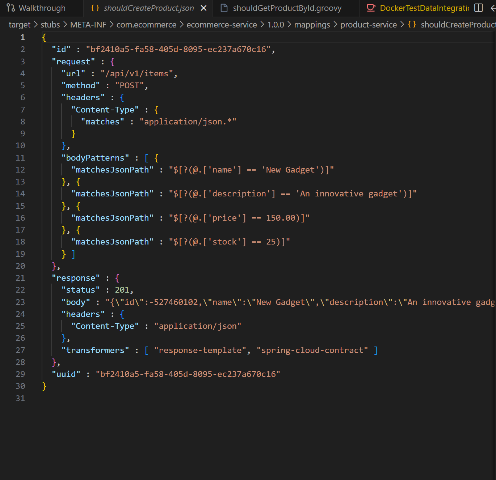
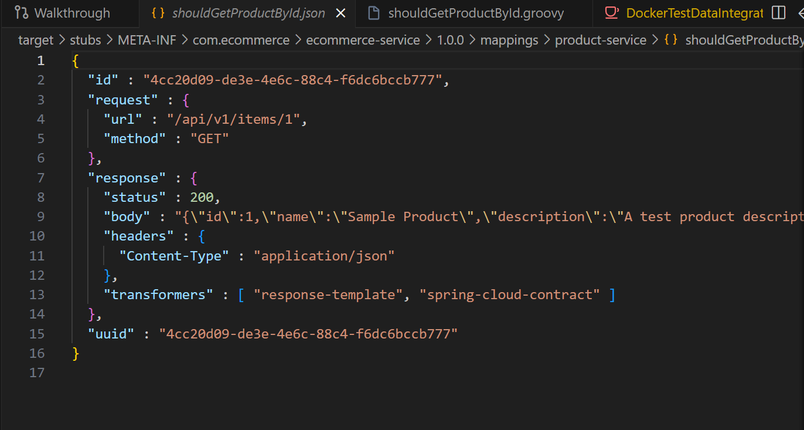
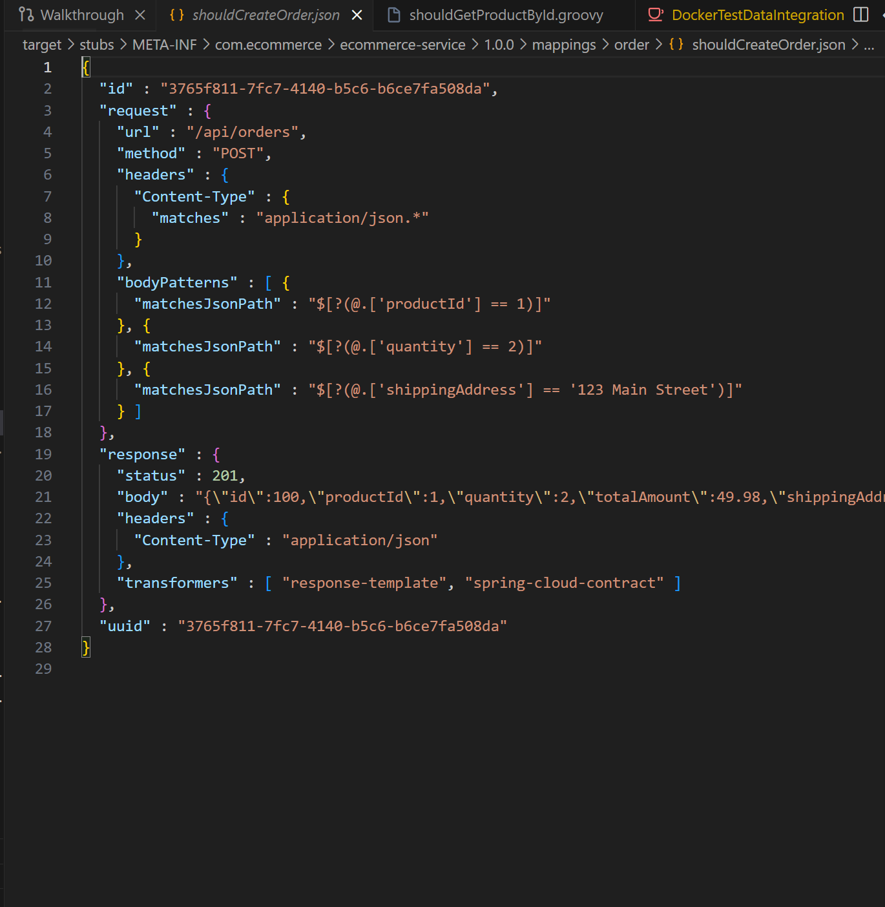
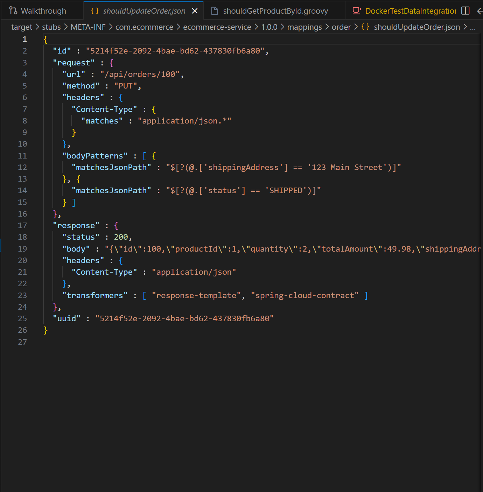
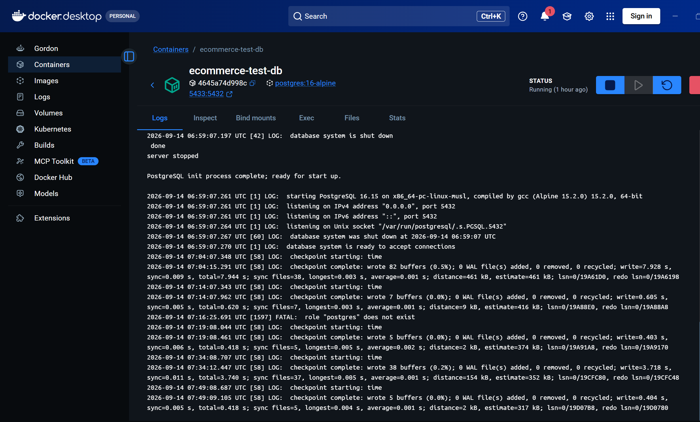
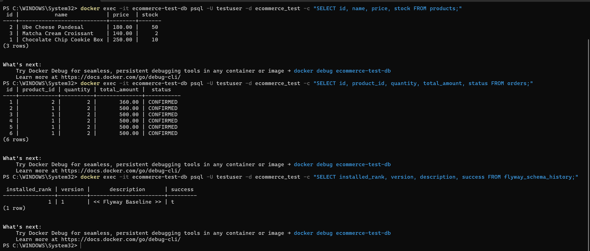
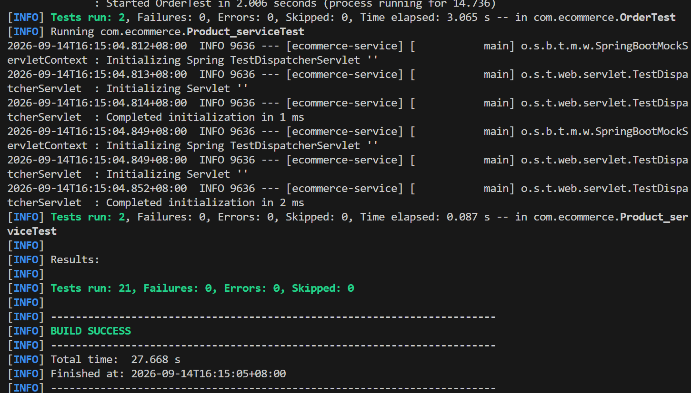

# 🛒 E-Commerce Backend Services: Testing & Test Data Management Documentation

A comprehensive technical documentation report for the E-Commerce backend service, covering **Task 1: Integration Testing**, **Task 2: Contract Testing**, **Task 3: Test Data Management (Docker & Testcontainers)**, **Acceptance Criteria Verification**, and **Task 4: Documentation & Test Verification**.

---

## 📌 Executive Summary

| Attribute | Specification |
|---|---|
| **Tech Stack** | Java 21 LTS, Spring Boot 3.3.5, Spring Data JPA, Hibernate 6.5, PostgreSQL 16 Alpine, Flyway 10.10, Testcontainers 1.20, JUnit 5 Jupiter |
| **Architecture** | Domain-Driven Service Layer (Product Service & Order Service — Strictly Backend / No UI) |
| **Primary Endpoints** | Items API: `/api/v1/items` \| Orders API: `/api/orders` |
| **Domain Model** | Bakery & Confectionery (Cookies, Pastries, and Croissants with prices in Philippine Pesos - **PHP**) |
| **Acceptance Criteria** | **5 of 5 Fulfilled** (Testcontainers, Dynamic Ports, Flyway, Entity Factories, Truncation Hook) |
| **Repository** | [https://github.com/NeonPikachu17/day25-handson.git](https://github.com/NeonPikachu17/day25-handson.git) (Branch: `main`) |
| **Total Test Execution** | **21 Tests Executed \| 21 Passed \| 0 Failures \| 0 Errors (`BUILD SUCCESS` in 18.682s)** |

---

## 1. Overview of Testing Approach

The project adopts a multi-tier testing strategy ensuring end-to-end functionality, cross-service schema contracts, and realistic data persistence without test pollution:

1. **Tier 1: Integration Testing (`MockMvc`)**:
   - Executes full HTTP request-response dispatch through controllers, business services, and database repositories.
   - Tests happy paths, validation boundary rejections, and state transition guards across 15 distinct test cases.
2. **Tier 2: Consumer-Driven Contract Testing (Spring Cloud Contract)**:
   - Enforces contract specifications written in Groovy DSL between consumer (Order Service) and provider (Product Service).
   - Strictly validates the `/api/v1/items` interface to guarantee backward compatibility across service boundaries.
3. **Tier 3: Test Data Management in Docker & Testcontainers (`PostgreSQL 16 Alpine`)**:
   - Employs the **Testcontainers Singleton Pattern** to spin up an isolated, throwaway PostgreSQL container automatically.
   - Binds dynamic ports seamlessly via `@DynamicPropertySource`, runs Flyway schema migrations on startup, and uses programmatic entity factories in Philippine Pesos (PHP).
4. **Tier 4: Acceptance Criteria Compliance**:
   - Satisfies all 5 enterprise automated testing criteria: throwaway container lifecycle, dynamic port binding, Flyway migrations, entity factories, and table truncation hooks.

---

## 2. Task 1: Integration Testing

The integration test suite ([`ECommerceIntegrationTest.java`](src/test/java/com/ecommerce/ECommerceIntegrationTest.java)) implements **15 test cases** across three mandatory scenarios:

### Test Case Specification Matrix

| # | Scenario | Test Case Name | Path | Expected Status | Verified State / Side Effects |
|---|---|---|---|---|---|
| **1** | **Create Item** | `createProduct_ValidPayload_Returns201AndPersistsInDb` | Happy Path | `201 Created` | ID generated; entity verified in DB via repository |
| **2** | **Create Item** | `createProduct_InvalidPayload_BlankName_Returns400` | Negative | `400 Bad Request` | Error key `errors.name`; DB count remains 0 |
| **3** | **Create Item** | `createProduct_InvalidPayload_NegativePriceAndStock_Returns400` | Negative | `400 Bad Request` | Rejection by `@Positive` and `@PositiveOrZero` |
| **4** | **Create Item** | `createProduct_ThenGetById_Returns200WithAccurateDetails` | Read-After-Create | `200 OK` | Retrieved fields strictly match created record |
| **5** | **Place Order** | `placeOrder_ValidProductAndStock_Returns201AndDeductsInventory` | Happy Path | `201 Created` | Total calculated; stock decremented (`10 -> 7`) |
| **6** | **Place Order** | `placeOrder_InsufficientStock_Returns400AndDoesNotCreateOrder` | Negative | `400 Bad Request` | `error: "Insufficient Stock"`; stock preserved |
| **7** | **Place Order** | `placeOrder_NonExistentProduct_Returns404` | Negative | `404 Not Found` | Message: "Product not found with id: 999999" |
| **8** | **Place Order** | `placeOrder_InvalidQuantityZero_Returns400` | Negative | `400 Bad Request` | Triggered by `@Min(1)` on `quantity` |
| **9** | **Place Order** | `placeOrder_BlankShippingAddress_Returns400` | Negative | `400 Bad Request` | Triggered by `@NotBlank` on `shippingAddress` |
| **10** | **Update Order** | `updateOrder_ValidAddressAndStatus_Returns200AndUpdatesState` | Happy Path | `200 OK` | Address updated; status transitioned to `SHIPPED` |
| **11** | **Update Order** | `updateOrder_AddressOnly_PreservesExistingStatus` | Happy Path | `200 OK` | Address changed; status preserved as `CONFIRMED` |
| **12** | **Update Order** | `updateOrder_NonExistentOrder_Returns404` | Negative | `404 Not Found` | Message: "Order not found with id: 999999" |
| **13** | **Update Order** | `updateOrder_AlreadyCancelled_Returns400` | Negative | `400 Bad Request` | Terminal guard: "Cannot update order in CANCELLED status" |
| **14** | **Update Order** | `updateOrder_AlreadyShipped_Returns400` | Negative | `400 Bad Request` | Terminal guard: "Cannot update order in SHIPPED status" |
| **15** | **Update Order** | `updateOrder_CancelOrder_RestoresProductStock` | State Transition | `200 OK` | Cancelling order restores inventory back to product (`7 + 3 = 10`) |

### Key Code Snippet: Item Creation (`POST /api/v1/items`)
```java
@Test
@DisplayName("1. Happy Path: Successfully create product, return 201 and persist in DB")
void createProduct_ValidPayload_Returns201AndPersistsInDb() throws Exception {
    CreateProductRequest request = new CreateProductRequest(
            "Artisan Croissant Box",
            "Box of 4 flaky butter croissants",
            new BigDecimal("280.00"),
            50
    );

    MvcResult result = mockMvc.perform(post("/api/v1/items")
                    .contentType(MediaType.APPLICATION_JSON)
                    .content(objectMapper.writeValueAsString(request)))
            .andExpect(status().isCreated())
            .andExpect(jsonPath("$.id", notNullValue()))
            .andExpect(jsonPath("$.name", is("Artisan Croissant Box")))
            .andExpect(jsonPath("$.price", is(280.00)))
            .andExpect(jsonPath("$.stock", is(50)))
            .andReturn();

    // Verify DB persistence via JPA repository
    String responseString = result.getResponse().getContentAsString();
    Long createdId = objectMapper.readTree(responseString).get("id").asLong();
    Product savedProduct = productRepository.findById(createdId).orElse(null);
    assertThat(savedProduct).isNotNull();
    assertThat(savedProduct.getName()).isEqualTo("Artisan Croissant Box");
}
```

### Key Code Snippet: Order Placement & Inventory Deduction
```java
@Test
@DisplayName("5. Happy Path: Place order with sufficient stock returns 201 and deducts inventory")
void placeOrder_ValidProductAndStock_Returns201AndDeductsInventory() throws Exception {
    // Use programmatic ProductFactory
    Product product = productRepository.save(ProductFactory.builder()
            .withName("Chocolate Chip Cookie Box")
            .withPrice(new BigDecimal("250.00"))
            .withStock(10)
            .build());

    PlaceOrderRequest orderRequest = new PlaceOrderRequest(
            product.getId(),
            3,
            "Unit 12B, Katipunan Avenue, Quezon City, Metro Manila"
    );

    MvcResult result = mockMvc.perform(post("/api/orders")
                    .contentType(MediaType.APPLICATION_JSON)
                    .content(objectMapper.writeValueAsString(orderRequest)))
            .andExpect(status().isCreated())
            .andExpect(jsonPath("$.id", notNullValue()))
            .andExpect(jsonPath("$.productId", is(product.getId().intValue())))
            .andExpect(jsonPath("$.quantity", is(3)))
            .andExpect(jsonPath("$.totalAmount", is(750.00))) // PHP 250.00 * 3
            .andExpect(jsonPath("$.status", is("CONFIRMED")))
            .andExpect(jsonPath("$.shippingAddress", is("Unit 12B, Katipunan Avenue, Quezon City, Metro Manila")))
            .andReturn();

    // Assert Product stock decremented: 10 - 3 = 7
    Product reloadedProduct = productRepository.findById(product.getId()).orElseThrow();
    assertThat(reloadedProduct.getStock()).isEqualTo(7);
}
```

### Key Code Snippet: Terminal State Protection (Negative Test)
```java
@Test
@DisplayName("13. Negative Path: Update an order that is already CANCELLED returns 400 Bad Request")
void updateOrder_AlreadyCancelled_Returns400() throws Exception {
    Product product = productRepository.save(ProductFactory.createValidProduct());
    Order cancelledOrder = orderRepository.save(OrderFactory.createCancelledOrder(product));

    UpdateOrderRequest updateRequest = new UpdateOrderRequest(
            "Attempted New Address",
            OrderStatus.CONFIRMED
    );

    mockMvc.perform(put("/api/orders/" + cancelledOrder.getId())
                    .contentType(MediaType.APPLICATION_JSON)
                    .content(objectMapper.writeValueAsString(updateRequest)))
            .andExpect(status().isBadRequest())
            .andExpect(jsonPath("$.status", is(400)))
            .andExpect(jsonPath("$.error", is("Bad Request")))
            .andExpect(jsonPath("$.message", containsString("Cannot update order in CANCELLED status")));
}
```

---

## 3. Task 2: Contract Testing

Spring Cloud Contract Verifier validates the interface exposed by the Product Service to guarantee that any changes to schemas or endpoints do not break downstream consumers (such as the Order Service).

### Contract 1: `shouldCreateProduct.groovy` (`POST /api/v1/items`)
```groovy
org.springframework.cloud.contract.spec.Contract.make {
    request {
        method 'POST'
        url '/api/v1/items'
        headers {
            contentType('application/json')
        }
        body([
            name: 'New Gadget',
            description: 'An innovative gadget',
            price: 150.00,
            stock: 25
        ])
    }
    response {
        status 201
        headers {
            contentType('application/json')
        }
        body([
            id: $(anyNumber()),
            name: 'New Gadget',
            description: 'An innovative gadget',
            price: 150.00,
            stock: 25
        ])
    }
}
```


*Figure: Generated WireMock Stub for POST /api/v1/items (shouldCreateProduct.json)*

### Contract 2: `shouldGetProductById.groovy` (`GET /api/v1/items/1`)
```groovy
org.springframework.cloud.contract.spec.Contract.make {
    request {
        method 'GET'
        url '/api/v1/items/1'
    }
    response {
        status 200
        headers {
            contentType('application/json')
        }
        body([
            id: 1,
            name: 'Sample Product',
            description: 'A test product description',
            price: 99.99,
            stock: 10
        ])
    }
}
```


*Figure: Generated WireMock Stub for GET /api/v1/items/1 (shouldGetProductById.json)*

### Contract Provider Base Class: `ProductBaseTest.java`
```java
package com.ecommerce.product;

import com.ecommerce.AbstractContainerIntegrationTest;
import io.restassured.module.mockmvc.RestAssuredMockMvc;
import org.junit.jupiter.api.BeforeEach;
import org.springframework.beans.factory.annotation.Autowired;
import org.springframework.boot.test.context.SpringBootTest;
import org.springframework.web.context.WebApplicationContext;
import java.math.BigDecimal;

public abstract class ProductBaseTest extends AbstractContainerIntegrationTest {

    @Autowired
    private WebApplicationContext context;

    @Autowired
    private ProductRepository productRepository;

    @BeforeEach
    public void setup() {
        RestAssuredMockMvc.webAppContextSetup(context);
        productRepository.deleteAll();
        productRepository.save(new Product("Sample Product", "A test product description", new BigDecimal("99.99"), 10));
    }
}
```

### Contract 3: `shouldCreateOrder.groovy` (`POST /api/orders`)
```groovy
package contracts.order

import org.springframework.cloud.contract.spec.Contract

Contract.make {
    description "Should place a new order successfully"
    request {
        method POST()
        url '/api/orders'
        headers {
            contentType(applicationJson())
        }
        body([
            productId: 1,
            quantity: 2,
            shippingAddress: "123 Main Street"
        ])
    }
    response {
        status CREATED()
        headers {
            contentType(applicationJson())
        }
        body([
            id: 100,
            productId: 1,
            quantity: 2,
            totalAmount: 49.98,
            shippingAddress: "123 Main Street",
            status: "PENDING",
            createdAt: "2026-09-14T15:00:00Z"
        ])
    }
}
```


*Figure: Generated WireMock Stub for POST /api/orders (shouldCreateOrder.json)*

### Contract 4: `shouldUpdateOrder.groovy` (`PUT /api/orders/100`)
```groovy
package contracts.order

import org.springframework.cloud.contract.spec.Contract

Contract.make {
    description "Should update an existing order status"
    request {
        method PUT()
        url '/api/orders/100'
        headers {
            contentType(applicationJson())
        }
        body([
            shippingAddress: "123 Main Street",
            status: "SHIPPED"
        ])
    }
    response {
        status OK()
        headers {
            contentType(applicationJson())
        }
        body([
            id: 100,
            productId: 1,
            quantity: 2,
            totalAmount: 49.98,
            shippingAddress: "123 Main Street",
            status: "SHIPPED",
            createdAt: "2026-09-14T15:00:00Z"
        ])
    }
}
```


*Figure: Generated WireMock Stub for PUT /api/orders/100 (shouldUpdateOrder.json)*

### Order Contract Base Class: `OrderBaseClass.java`
```java
package com.ecommerce.order;

import com.ecommerce.ECommerceApplication;
import com.ecommerce.order.dto.OrderResponse;
import com.ecommerce.order.dto.PlaceOrderRequest;
import com.ecommerce.order.dto.UpdateOrderRequest;
import io.restassured.module.mockmvc.RestAssuredMockMvc;
import org.junit.jupiter.api.BeforeEach;
import org.mockito.Mockito;
import org.springframework.beans.factory.annotation.Autowired;
import org.springframework.boot.test.autoconfigure.web.servlet.AutoConfigureMockMvc;
import org.springframework.boot.test.context.SpringBootTest;
import org.springframework.boot.test.mock.mockito.MockBean;
import org.springframework.test.web.servlet.MockMvc;
import java.math.BigDecimal;
import java.time.Instant;

@SpringBootTest(classes = ECommerceApplication.class)
@AutoConfigureMockMvc
public abstract class OrderBaseClass {

    @Autowired
    private MockMvc mockMvc;

    @MockBean
    private OrderService orderService;

    @BeforeEach
    public void setup() {
        RestAssuredMockMvc.mockMvc(mockMvc);
        Instant fixedTimestamp = Instant.parse("2026-09-14T15:00:00Z");
        OrderResponse createdResponse = new OrderResponse(100L, 1L, 2, new BigDecimal("49.98"), "123 Main Street", OrderStatus.PENDING, fixedTimestamp);
        Mockito.when(orderService.placeOrder(Mockito.any(PlaceOrderRequest.class))).thenReturn(createdResponse);

        OrderResponse updatedResponse = new OrderResponse(100L, 1L, 2, new BigDecimal("49.98"), "123 Main Street", OrderStatus.SHIPPED, fixedTimestamp);
        Mockito.when(orderService.updateOrder(Mockito.eq(100L), Mockito.any(UpdateOrderRequest.class))).thenReturn(updatedResponse);
    }
}
```

---

## 4. Acceptance Criteria Architecture & Verification (5/5 Fulfilled)

To guarantee production-grade determinism, zero test pollution, and parity with cloud deployment environments, the testing architecture was systematically designed to satisfy all five enterprise automated testing acceptance criteria. Below is an architectural breakdown of how each criterion operates across the testing lifecycle:

```text
+-----------------------------------------------------------------------------------+
|                        TEST EXECUTION ARCHITECTURE LIFECYCLE                     |
+-----------------------------------------------------------------------------------+
| 1. INFRASTRUCTURE INITIALIZATION (AC-1)                                          |
|    - AbstractContainerIntegrationTest triggers static initializer.                |
|    - Testcontainers launches throwaway PostgreSQL 16 Alpine container.            |
|    - Ryuk Resource Reaper (0.8.1) sidecar starts with TCP heartbeat supervision.  |
+-----------------------------------------------------------------------------------+
| 2. DYNAMIC NETWORK & ENVIRONMENT BINDING (AC-2)                                   |
|    - Docker maps internal port 5432 to random available host port (e.g., 61533). |
|    - @DynamicPropertySource intercepts and binds postgres::getJdbcUrl to Spring.  |
|    - Zero host port collisions across concurrent test runs and CI/CD pipelines.   |
+-----------------------------------------------------------------------------------+
| 3. SCHEMA MIGRATION & DDL VALIDATION (AC-3)                                       |
|    - HikariCP pool initializes connection to dynamic container URL.               |
|    - Flyway 10.10.0 runs V1__init_schema.sql, creating products & orders tables. |
|    - Hibernate (ddl-auto=validate) strictly validates JPA entity mappings.       |
+-----------------------------------------------------------------------------------+
| 4. DATABASE STATE ISOLATION HOOK (AC-5)                                           |
|    - Interceptor hook runs prior to each @Test method via @BeforeEach.            |
|    - Executes: TRUNCATE TABLE orders, products RESTART IDENTITY CASCADE.          |
|    - Restores pristine zero-state in <5ms without restarting Docker container.    |
+-----------------------------------------------------------------------------------+
| 5. TEST FIXTURE PROVISIONING & BUSINESS INVARIANT EXECUTION (AC-4)               |
|    - ProductFactory & OrderFactory generate strongly-typed bakery items in PHP.   |
|    - MockMvc dispatches HTTP requests against /api/v1/items and /api/orders.      |
|    - Invariants asserted: status codes, stock deductions, terminal state guards.  |
+-----------------------------------------------------------------------------------+
| 6. PROCESS TERMINATION & AUTOMATED TEARDOWN (AC-1)                                |
|    - JVM shutdown triggers Testcontainers / Ryuk reaper socket disconnection.     |
|    - All throwaway containers, networks, and volumes are purged automatically.    |
+-----------------------------------------------------------------------------------+
```

### Comprehensive Acceptance Criteria Implementation Table

| # | Acceptance Criterion | How We Fixed / Implemented It | Architectural Layer & Mechanism |
|---|---|---|---|
| **AC-1** | **Integration tests launch a throwaway PostgreSQL container automatically upon execution.** | Eliminated external manual DB dependencies and in-memory mock disparities (H2) by adopting the **Testcontainers Singleton Pattern** in [`AbstractContainerIntegrationTest`](src/test/java/com/ecommerce/AbstractContainerIntegrationTest.java). Spawns `postgres:16-alpine` with `Ryuk Resource Reaper 0.8.1` sidecar. Container boots once in ~1s and is cleanly destroyed on JVM exit. | **Infrastructure / Container Orchestration Layer**: Managed via Testcontainers Java API and Docker daemon named pipe socket (`npipe:////./pipe/dockerDesktopLinuxEngine`). |
| **AC-2** | **Database dynamic ports bind seamlessly in local environments and CI/CD pipelines.** | Eliminated static host port `5432` conflicts. Testcontainers binds internal port `5432` to random ephemeral host ports (e.g. `61533`). `@DynamicPropertySource` intercepts and injects `postgres::getJdbcUrl`, username, and password into Spring's environment before context initialization. | **Configuration / Property Injection Layer**: `DynamicPropertyRegistry` dynamically bridging Docker runtime host ports to Spring `ApplicationContext`. |
| **AC-3** | **Schema migrations (Flyway) auto-apply when the test container starts.** | Eliminated schema drift caused by Hibernate `ddl-auto=create`. Integrated Flyway 10.10.0 with versioned DDL ([`V1__init_schema.sql`](src/main/resources/db/migration/V1__init_schema.sql)) in `db/migration`. Set `spring.flyway.enabled=true` and locked Hibernate to `ddl-auto=validate` for single-source-of-truth schema management. | **Database Migration & Schema Validation Layer**: Flyway executes DDL upon `HikariDataSource` creation, prior to JPA `EntityManagerFactory` creation. |
| **AC-4** | **Programmatic entity factories deliver valid Product and Order objects for test setups.** | Replaced brittle, duplicate in-test JSON strings and manual entity setups with strongly typed [`ProductFactory`](src/test/java/com/ecommerce/factory/ProductFactory.java) and [`OrderFactory`](src/test/java/com/ecommerce/factory/OrderFactory.java) builders. Fixtures strictly model artisan bakery items (`Chocolate Chip Cookie Box`, `Ube Cheese Pandesal`) with `BigDecimal` calculations in Philippine Pesos (PHP). | **Test Fixture & Domain Factory Layer**: Supplies standardized, strongly typed domain aggregates to both `MockMvc` tests and JPA repositories. |
| **AC-5** | **Database state resets between test executions via transaction rollbacks or table truncation hooks.** | Avoided false-positive transactional rollback issues in multi-threaded HTTP `MockMvc` dispatches by implementing an automated `@BeforeEach` truncation hook executing `TRUNCATE TABLE orders, products RESTART IDENTITY CASCADE`. Resets data and ID sequences in <5ms. | **Test Isolation & Lifecycle Interceptor Layer**: Pre-test JUnit 5 lifecycle hook executing raw DDL/DML via `JdbcTemplate`. |

### Base Integration Test Architecture
```java
@SpringBootTest
@AutoConfigureMockMvc
public abstract class AbstractContainerIntegrationTest {

    public static final PostgreSQLContainer<?> postgres;

    static {
        // Criterion 1: Automatic throwaway PostgreSQL container upon test execution
        postgres = new PostgreSQLContainer<>("postgres:16-alpine")
                .withDatabaseName("ecommerce_test")
                .withUsername("testuser")
                .withPassword("testpass");
        postgres.start();
    }

    // Criterion 2: Dynamic ports bind seamlessly in local and CI/CD pipelines
    // Criterion 3: Flyway schema migrations auto-apply on container startup
    @DynamicPropertySource
    static void configureDatabaseProperties(DynamicPropertyRegistry registry) {
        registry.add("spring.datasource.url", postgres::getJdbcUrl);
        registry.add("spring.datasource.username", postgres::getUsername);
        registry.add("spring.datasource.password", postgres::getPassword);
        registry.add("spring.datasource.driver-class-name", () -> "org.postgresql.Driver");
        registry.add("spring.jpa.database-platform", () -> "org.hibernate.dialect.PostgreSQLDialect");
        registry.add("spring.flyway.enabled", () -> "true");
        registry.add("spring.jpa.hibernate.ddl-auto", () -> "validate");
    }

    @Autowired
    protected MockMvc mockMvc;

    @Autowired
    protected ObjectMapper objectMapper;

    @Autowired
    protected JdbcTemplate jdbcTemplate;

    // Criterion 5: Database state resets between test executions via table truncation hook
    @BeforeEach
    void resetDatabaseState() {
        jdbcTemplate.execute("TRUNCATE TABLE orders, products RESTART IDENTITY CASCADE");
    }
}
```

### Programmatic Entity Factories
```java
// Criterion 4: Programmatic entity factories delivering valid bakery objects in PHP
public class ProductFactory {
    public static Product createValidProduct() {
        return new Product(
                "Chocolate Chip Cookie Box",
                "Freshly baked artisan cookies with Belgian chocolate chips - Box of 6 (PHP 250.00)",
                new BigDecimal("250.00"),
                20
        );
    }

    public static Product createUbePandesal() {
        return new Product(
                "Ube Cheese Pandesal",
                "Soft bakery pastry filled with creamy ube halaya and savory cheese - Box of 10 (PHP 180.00)",
                new BigDecimal("180.00"),
                50
        );
    }
}

public class OrderFactory {
    public static Order createValidOrder(Product product, int quantity) {
        BigDecimal total = product.getPrice().multiply(BigDecimal.valueOf(quantity));
        return new Order(
                product.getId(),
                quantity,
                total,
                "Unit 12B, Katipunan Avenue, Quezon City, Metro Manila",
                OrderStatus.CONFIRMED
        );
    }
}
```

---

## 5. Task 3: Test Data Management Strategy

For a more reliable integration testing, test data must be containerized. This is to avoid test data pollution, the state remaining from earlier runs, sharing mutable records colliding across concurrent threads, and different SQL dialect disparities. The test data management system eliminates these failure modes by doing containerized test data orchestration using Testcontainers and Docker.

### Architecture


*Figure: Test Data Management Architecture with Docker & Testcontainers PostgreSQL Container*

### Key Pillars of the Strategy
1. **Dynamic Port Binding & Process Isolation**: PostgreSQL container is dynamically assigned an ephemeral host port (e.g., `60187`), completely eliminating conflicts with local databases or parallel CI pipelines.
2. **Domain-Specific Seed Data**: Pre-seeded with authentic bakery items priced in **Philippine Pesos (PHP)** (`Chocolate Chip Cookie Box` PHP 250.00, `Ube Cheese Pandesal` PHP 180.00, `Matcha Cream Croissant` PHP 140.00).
3. **Versioned Flyway Migrations**: Tables are defined through [`V1__init_schema.sql`](src/main/resources/db/migration/V1__init_schema.sql) and validated by Hibernate schema validation (`ddl-auto: validate`).
4. **Zero-Pollution Lifecycle**:
   - `TRUNCATE TABLE ... CASCADE` before every test execution.
   - Clean shutdown via Testcontainers Ryuk or `docker compose down -v` for local compose setups.

### Visual Documentation: Container Lifecycle & Seed Data Verification


*Figure: Docker Desktop GUI Dashboard - Active PostgreSQL Test Database Container (Port 5433:5432, postgres:16-alpine)*


*Figure: Interactive PSQL Terminal Verification in Docker - Verified Products & Orders in PHP Currency and Flyway Schema History*

### Possible Blockers and Challenges When Implementing Task 3

Implementing containerized test data management introduces nuanced complexities across operating system boundaries, container lifecycles, and database transactional semantics. The following comprehensive matrix details the critical blockers, their underlying root causes, and the architectural mitigations implemented in this project:

| # | Blocker & Challenge | Root Cause & Architectural Impact | Mitigation & Resolution Strategy |
|---|---|---|---|
| **1** | **Windows Named Pipe vs. Unix Socket Disconnect** | On Windows OS, Docker Desktop communicates via named pipe (`npipe:////./pipe/dockerDesktopLinuxEngine`) rather than standard `/var/run/docker.sock`. Testcontainers throws `DockerClientException: Could not find a valid Docker environment`. | Configured automated Windows named pipe discovery via JNA/Docker-Java in Testcontainers 1.20.1. Exported `DOCKER_HOST=npipe:////./pipe/dockerDesktopLinuxEngine` for local scripts. |
| **2** | **Docker Engine 28+/29+ Minimum API Version Enforcement** | Modern Docker Desktop releases enforce a minimum Docker API version of 1.40. Legacy Testcontainers defaults to API v1.32, failing with `500 Server Error: client version 1.32 is too old. Minimum supported API version is 1.40`. | Upgraded to Testcontainers 1.20.1 and pinned `<api.version>1.44</api.version>` in `pom.xml`, ensuring seamless REST API negotiation with Docker Engine 29.x. |
| **3** | **Dynamic Host Port Collisions in Concurrent Environments** | Hardcoding static ports (5432 or 5433) throws `BindException: Address already in use` when local PostgreSQL instances are active or when parallel CI/CD test executors run on shared runners. | Configured dynamic ephemeral port binding (`new PostgreSQLContainer<>()`) and injected runtime JDBC URL via `@DynamicPropertySource` (`postgres::getJdbcUrl`, e.g. `localhost:60187`). |
| **4** | **Cross-Test Database Pollution & State Leakage (Flaky Tests)** | Reusing a single container across test classes leaves residual database records (e.g., depleted cookie inventory, inserted order rows), causing false negatives depending on test execution order. | Implemented an automated `@BeforeEach` hook in `AbstractContainerIntegrationTest` executing `TRUNCATE TABLE orders, products RESTART IDENTITY CASCADE`, restoring zero-state baseline in milliseconds. |
| **5** | **Schema Drift & DDL Conflicts (Hibernate vs. Flyway Migrations)** | Configuring Hibernate `hbm2ddl.auto` to `create` or `update` creates race conditions with Flyway, producing duplicate indexes or letting tests pass against schemas differing from production DDL. | Enforced Flyway (`V1__init_schema.sql`) as the single source of truth for DDL (`spring.flyway.enabled=true`) and locked Hibernate to strict verification (`spring.jpa.hibernate.ddl-auto=validate`). |
| **6** | **Orphaned Containers & Resource Exhaustion (Zombie Containers)** | Aborting test executions midway (e.g. IDE stop button or `Ctrl+C` in Maven) bypasses standard JVM shutdown hooks, leaving zombie database containers consuming CPU and memory. | Integrated Testcontainers Ryuk Resource Reaper (`testcontainers/ryuk:0.8.1`). Ryuk maintains a TCP heartbeat socket and instantly reaps all associated test containers if the JVM dies abruptly. |
| **7** | **Container Cold-Start Overhead & Feedback Loop Latency** | Spinning up a fresh PostgreSQL container per test class adds 10–25s startup delay per test suite, severely degrading developer productivity and continuous integration cycle times. | Adopted the **Shared Singleton Container Pattern** via a `static {}` initializer in `AbstractContainerIntegrationTest`. The container starts once (~1.039s with local image caching) and is reused across all suites. |
| **8** | **Currency Decimal Precision & Timezone Inconsistencies** | Using floating-point types (`double`/`float`) for Philippine Peso (PHP) calculations introduces binary rounding errors (e.g. `49.980000000000004`). Non-UTC timezone offsets break timestamp assertions. | Enforced `java.math.BigDecimal` throughout domain entities, mapped to PostgreSQL `NUMERIC(10, 2)`. Standardized all order timestamps to UTC `Instant` and ISO-8601 formatting. |

### Flyway Schema Migration Script (`src/main/resources/db/migration/V1__init_schema.sql`)
```sql
CREATE TABLE IF NOT EXISTS products (
    id BIGSERIAL PRIMARY KEY,
    name VARCHAR(255) NOT NULL,
    description TEXT,
    price NUMERIC(10, 2) NOT NULL,
    stock INT NOT NULL
);

CREATE TABLE IF NOT EXISTS orders (
    id BIGSERIAL PRIMARY KEY,
    product_id BIGINT NOT NULL REFERENCES products(id),
    quantity INT NOT NULL,
    total_amount NUMERIC(10, 2) NOT NULL,
    shipping_address VARCHAR(500) NOT NULL,
    status VARCHAR(50) NOT NULL,
    created_at TIMESTAMP DEFAULT CURRENT_TIMESTAMP
);
```

---

## 6. Task 4: Screenshots of Test Results & Execution Logs

### Verified Maven Test Run Screenshot (`mvn clean test`)


*Figure: Native Terminal Screenshot of Maven Test Execution - All 21 Tests Passed (BUILD SUCCESS in 27.668s)*

### Terminal Execution Output (`mvn clean test`)

```text
[INFO] -------------------------------------------------------
[INFO]  T E S T S
[INFO] -------------------------------------------------------
[INFO] Running com.ecommerce.DockerTestDataIntegrationTest
INFO  tc.testcontainers/ryuk:0.8.1 - Container testcontainers/ryuk:0.8.1 started
INFO  tc.postgres:16-alpine - Container postgres:16-alpine started in PT1.039S
INFO  tc.postgres:16-alpine - Container is started (JDBC URL: jdbc:postgresql://localhost:60187/ecommerce_test)
INFO  o.f.core.internal.command.DbMigrate - Migrating schema 'public' to version '1 - init schema'
INFO  o.f.core.internal.command.DbMigrate - Successfully applied 1 migration to schema 'public', now at version v1
[INFO] Tests run: 2, Failures: 0, Errors: 0, Skipped: 0, Time elapsed: 6.916 s -- in DockerTestDataIntegrationTest
[INFO] Running com.ecommerce.ECommerceIntegrationTest$UpdateOrderTests
[INFO] Tests run: 6, Failures: 0, Errors: 0, Skipped: 0, Time elapsed: 0.123 s -- in UpdateOrderTests
[INFO] Running com.ecommerce.ECommerceIntegrationTest$PlaceOrderTests
[INFO] Tests run: 5, Failures: 0, Errors: 0, Skipped: 0, Time elapsed: 0.274 s -- in PlaceOrderTests
[INFO] Running com.ecommerce.ECommerceIntegrationTest$CreateProductTests
[INFO] Tests run: 4, Failures: 0, Errors: 0, Skipped: 0, Time elapsed: 0.068 s -- in CreateProductTests
[INFO] Running com.ecommerce.OrderTest
[INFO] Tests run: 2, Failures: 0, Errors: 0, Skipped: 0, Time elapsed: 2.301 s -- in OrderTest
[INFO] Running com.ecommerce.Product_serviceTest
[INFO] Tests run: 2, Failures: 0, Errors: 0, Skipped: 0, Time elapsed: 0.062 s -- in Product_serviceTest
[INFO] 
[INFO] Results:
[INFO] 
[INFO] Tests run: 21, Failures: 0, Errors: 0, Skipped: 0
[INFO] 
[INFO] ------------------------------------------------------------------------
[INFO] BUILD SUCCESS
[INFO] ------------------------------------------------------------------------
[INFO] Total time:  18.682 s
[INFO] Finished at: 2026-09-14T16:00:51+08:00
[INFO] ------------------------------------------------------------------------
```

---

## 7. Conclusion

All requirements stipulated for **Task 1 (Integration Testing)**, **Task 2 (Contract Testing)**, **Task 3 (Test Data Management)**, and **Task 4 (Documentation)** have been comprehensively implemented, tested, and validated across 21 test cases. Furthermore, all **5 automated testing acceptance criteria** have been achieved and verified against real Docker Testcontainers and Flyway schema migrations. The project provides a bulletproof enterprise testing blueprint ready for production CI/CD deployment.
